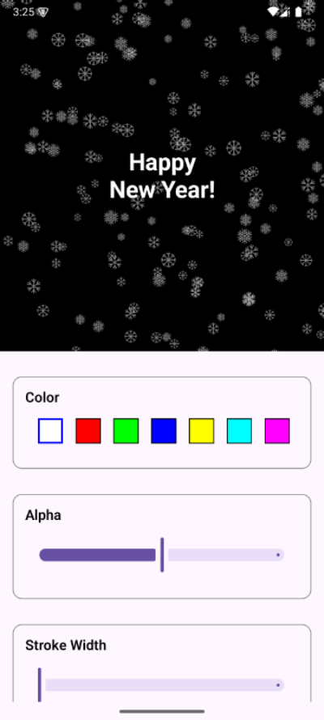

# snowfall-compose

Very simple snowfall animation modifier for Compose Multiplatform.
  


## :arrow_forward: [Live Demo](https://skeptick.github.io/snowfall-compose/)

## Setup

```kotlin
kotlin {
    commonMain {
        dependencies {
            implementation("io.github.skeptick.snowfall:snowfall-compose:1.0.0")
        }
    }
}
```

## Usage

```kotlin
Box(
    modifier = Modifier
        .fillMaxSize()
        .snowfall()
)
```

```kotlin
Box(
    modifier = Modifier
        .fillMaxSize()
        .snowfall(
            color = Color.White,
            alpha = 0.3f,
            strokeWidth = 1f,
            drawPosition = SnowfallDrawPosition.Ahead,
            snowflakeMinSize = 10.dp,
            snowflakeMaxSize = 20.dp,
            snowflakeMinSpeed = 0.5f,
            snowflakeMaxSpeed = 1.5f,
            snowflakeDensity = 1f
        )
) {
    // content
}
```